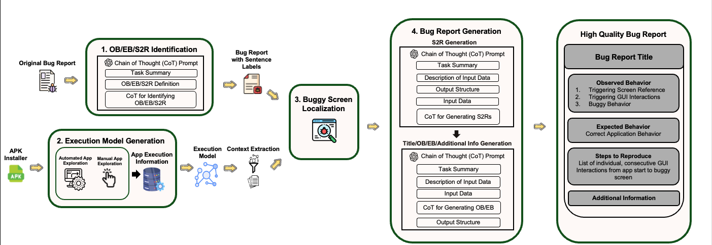

# GPT-BR: Leveraging generative AI to generate high quality mobile app bug reports

## Motivation
All mobile apps struggle with software bugs. While some bugs can be reported automatically (e.g crash and error type bugs), navigation bugs and general user interface bugs must be reported manually. In the current climate of bug reporting, a user will fill out a bug reporting form with the details of the bug they experienced and submit it to an issue tracking system so that an app developer can solve the bug. However, the standard issue tracking form contains overly complex language and does not provide any feedback to the user about the inaccuracy of their bug report. This leads to ambagious, incorrect and incomplete bug reports which cost mobile app developers extra time and effort. I and members of the [Software Evolution and Analysis Lab at William and Mary](https://ojcchar.github.io/lab/) proposed GPT-BR to solve this problem and enhance/clarify user bug reports before they are viewed by developers. 

## Overview
GPT-BR leverages the reasoning power of OpenAI o4-mini supported by textual application execution information, through a network of prompts, to digest a user bug report, validate its content against application execution data, and generate a new bug report which is a complete and clarrified version of the original bug report. 

## GPT-BR Architecture
Architecture Diagram:

1. OB/EB/S2R Sentence Identification: o4-mini is given a user bug report and instructed to identify content pertaining to the 3 major bug report sections: Observed Behavior (OB), Expected Behavior (EB) and Steps to Reproduce (S2R). The output is 3 groups of user bug report sentences, one for each major bug report section. These labels are passed along with the original bug report in later generation stages of the approach to assist o4-mini in prioritizing stage specific data when responding. Example prompts can be found in the [OB,EB,S2R Sentence Identification Folder](prompt_examples/OB_EB_S2R_Identification).

2. Execution Model Generation: Our execution model is a graphical representation of a mobile apps GUI hierarchy built from real application execution data, collected manually by researchers and through the automatic application exploration techniques, Trace Replayer and CrashScope. Once an execution model is constructed, GPT-BR refactors and regroups app execution information into sections easily digestable by 04-mini, a process we deem "context extraction". Examples of execution models and refactoring code can be found in the [Execution Model Folder](execution_model).

3. Buggy Screen Localization: GPT-BR levarages o4-mini through a Chain of Thought prompt, to analyze the user bug report with marked OB/EB/S2R sentences and refactored application execution information and then identify a ranked list of application screens that the user's reported bug could potentially have appeared on. Example CoT Screen Localization prompts can be found in the [Buggy Screen Localization Folder](prompt_examples/Buggy_Screen_Localization).

4. S2R Generation: o4-mini is given a Chain of Thought prompt instructing it to use the top ranked screen from the ranked list of buggy screens created in step 3, as the stopping point in the generation of a list of steps to reproduce the users bug. The steps in the list created by o4-mini represent consevutive, individual GUI interactions that the user made. Example CoT Steps to Reproduce Generation prompts can be found in the [S2R Generation Folder](prompt_examples/S2R_Generation).

5. Title/OB/EB/Additional Information Generation: 04-mini takes the list of steps to reproduce from step 4, the refactored application execution information, the bug manifesting screen and the user submitted bug report with bug report section markers and generates the bug report title, observed behavior, expected behavior and finally any additional information pertinent to the bug. A novel contribution of this research was defining information elements that define observed behavior and expected behavior as high quality. We created four information elements across both major report sections:
    - OB:
        - Buggy Behavior: The specific buggy behavior (i.e., the problem) reported in the bug
        - Triggering GUI Interactions: The user interaction(/s) on the application that triggers the bug.
        - Triggering Screen References: The application screen where performing the interaction causes the bug and/or the screen where the bug was observed.

    - EB:
        - Correct Behavior: The specific correct application behavior that should happen instead of the buggy behavior.
        
    We engineered our generation prompt to instruct o4-mini to procedurely construct these information elements from the execution model data and include them in the generated response. An example CoT Title/OB/EB/Additional Information generation prompt can be found in the [Title, OB, EB, Additional Information Generation Folder](prompt_examples/Title_OB_EB_Additional_Info_Generation)

6. High-Quality Bug Report Compilation: Generated Title, Observed Behavior, Expected Behavior, Steps to Reproduce and Additional Information, are joined in the order specified in the above archtecture figure to create a high-quality, application accurate, bug report. 

## Example I/O
In the [Example Inputs and Outputs Folder](example_inputs_outputs), you will find 2 example bugs, including input user bug report, GPT generated output bug reports and "ideal", Ground Truth bug report. Comparing the three, you can see that GPT-BR greatly increases the quality of the user bug report, nearing the level of the ideal bug report. For a full analysis of results, see the below section. 

## Results

### Current State of Bug Reporting

In past research projects studying the quality of user bug reports, the Software Evolution and Analysis Lab discovered that while 93.5% of user bug reports contain the Observed Behavior, only 35.2% and 51.4% explicitly describe the Expected Behavior and Steps to Reproduce respectively (FSE'19). In addition to this, software developers have complained to issue tracking systems about the content of steps to reproduce being often incomplete, superficial, ambiguos or too complex to follow (FSE'17). 

### GPT-BR's Improvements

With GPT-BR, we have not only be able to garuntee the inclusion of all 3 key bug reporting elements, but have greatly increased their quality and clarity in comparison to their original counter parts. In the first figure above, you can see a representation of the quality of S2Rs we created using GPT-BR. With our best prompt, we achieved 89.8% Precision, 76.2% Recall and 82.5% F1 score meaning that from a set of perfect gui-level steps to reproduce a bug, our generated s2rs for that bug include almost all perfect steps. 

For our evaluation of Observed Behavior and Expected Behavior, we needed to come up with a novel way of gauging correctness. We landed on a quality model that marked each information element of observed behavior and expected behavior, as listed in step 5 above, as Correct, Incomplete, Ambiguous, Missing or Incorrect. Our evaluation of GPT-BR is ongoing (specific graph will be added later), however our early results show strong improvement over user bug reports, with GPT-BR generated observed behavior and expected behavior having almost all correct information elements. 